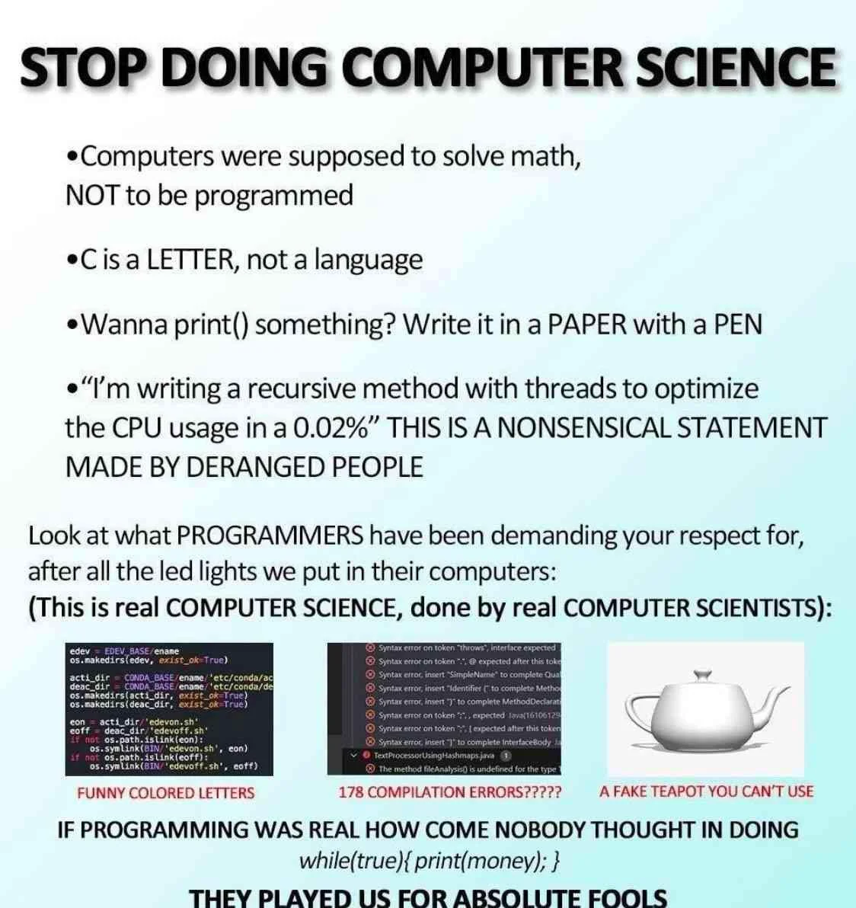
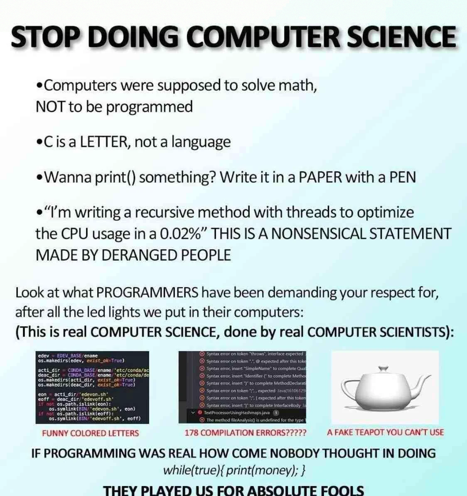

Fall 2024 UGA SSRL Flight Software Take Home Project
====================================================

Description
-----------

For this project, I was tasked to encode an ASCII message into a PNG image without (noticeably) visually
altering the image. I decided to implement a very rudimentary Least Significant Bit (LSB) steganography 
algorithm. To reduce errors, the message is encoded with Hamming(12, 8) codes that can not just detect
errors in transmission, but can correct them.

How it works
------------

### The Encoding

1. Read the input image file with stb and store each subpixel value with a `char*`.
2. Read the message file and store each letter in a `char*`.
3. Add the signature, "Nic", and the length of the message to the beginning of the `char*`.
4. For each letter, add the Hamming(12, 8) code.
5. Split the encoded letter's bits into 4 groups of 3 and overwrite the 3 LSB of each of the subpixels with it.
6. Write each of these encoded pixels to the output image file with stb.

Observe the following for an example of encoding the letter 'B' into a pixel of the value #9C4E97FF:

- Image pixel value is #9C4E97FF so with the `char*` it is stored as `[0x9C, 0x4E, 0x97, 0xFF]`.
- 'B' = `0b01000010`.
- Hamming(12, 8) of `0b01000010` is `0b010110010010`.
- Split the encoded letter into `[0b010, 0b110, 0b010, 0b010]`.
- Write each group of 3 into the pixels R, B, G, and A channels.
  
  
    
  The image on the left is before encoding and on the right is after encoding.

- Then write this to the output image file.

### The Decoding

1. Read the input image file with stb and store each subpixel value with a `char*`.
2. Take the 3 LSBs of the first 3 pixels' subchannels and Hamming(12, 8) decode them to the original bytes
   - Then check if this is the signature, "Nic"; continue decoding if so
3. Take the 3 LSBs of the next 4 pixels's subchannels to get the length of the message.
4. Continue decoding up to the length of the message and writing each letter to the output message file.

Design Decisions
----------------
### Why LSB encoding?

Right at beginning of the project, I did some research about hiding text inside of images. After that
research, I found this general process is called steganography. I then read 
[this article](https://en.wikipedia.org/wiki/List_of_steganography_techniques) of common steganography
techniques, I found LSB to be a pretty simple. The example in it used 2 LSBs of each color channel. 
I had originally used 2 as well because I had wanted to use 1 pixel per 1 letter, however, later I decided
to add Hamming(12, 8) codes so I had to use 3 LSBs per channel. This decreased the similarity of the 
input and output images, however, I don't think it is too noticeable when viewed at a distance. 

### Why Hamming(12, 8)?

A long while ago, I watched Grant Sanderson's (3Blue1Brown) [video about Hamming Codes](https://youtu.be/X8jsijhllIA).
In it, Sanderson explained Hamming codes with Hamming(15, 11) codes. I wanted to use something similar, 
but I didn't want to use 15 bits since that would cause a lot more image distortion. I also wanted to 
be able to store 8 bits (1 letter) and total length to be divisible by 4 (for the channels). A way to
use 4 bits for parity would be super useful. I had a feeling it is very similar to how Sanderson explained
with Hamming(15, 11) codes. A quick Google search for Hamming(12, 8) codes provided a
[useful result](https://courses.cs.vt.edu/cs2506/Fall2013/Notes/L21.ErrorCodes.pdf) which showed, yes,
it is very similar.

### Why STB?

I am very new to C and had to do a little research of how to read and write image files (specifically PNGs).
I looked it on Google and found two common PNG libraries: [libpng](http://www.libpng.org/pub/png/libpng.html)
and [stb](https://github.com/nothings/stb). I chose stb because, frankly, it looked a lot more simple
to setup and use compared to libpng. 

Platform
--------
This was written, compiled, and tested on Linux Mint 21.3 x86_64. It was also tested and ran on UGA's Odin servers.  
Here is a sample input file with the entire script of Dreamworks' *Bee Movie* encoded in it:  

  
The image on the left is before encoding and on the right is after encoding.